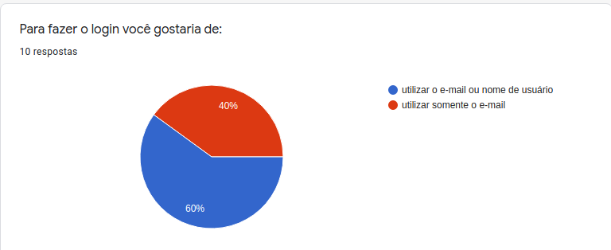
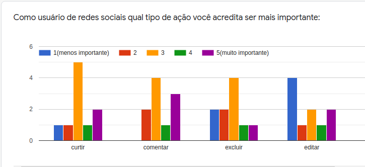
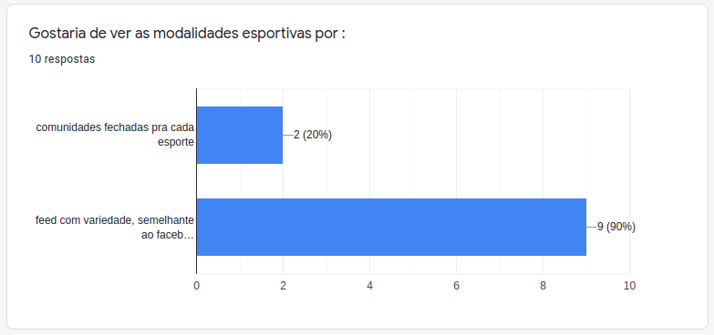
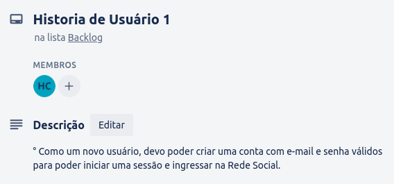
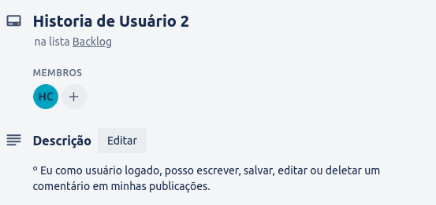
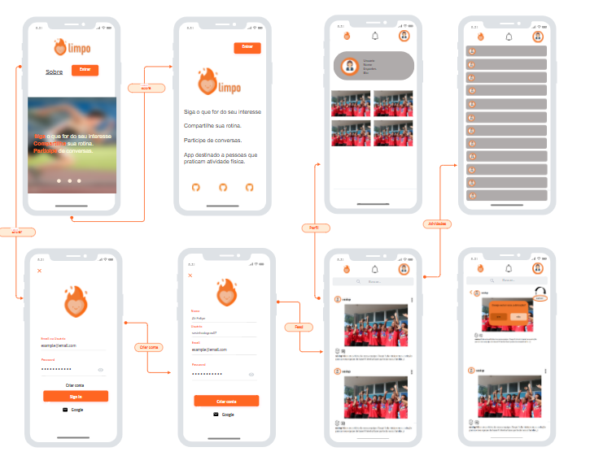
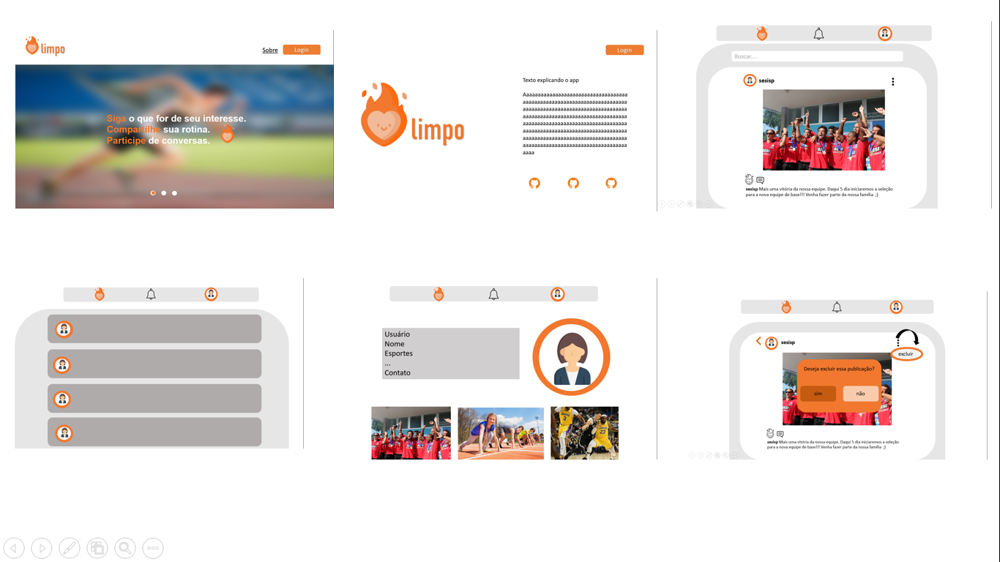

## Índice

- [1. Descrição](#1-descrição)
- [2. Conheça Olimpo](#2-conheça-olimpo)
- [3. Definições do produto](#3-definições-do-produto)
- [4. Tecnologias Utilizadas](#4-tecnologias-utilizadas)
- [5. Considerações Finais](#5-considerações-finais)
- [6. Criado por](#6-criado-por)
- [7. Entrega](#7-entrega)
- [8. Guias, dicas e leituras
  complementares](#8-guias-dicas-e-leituras-complementares)

---

## 1. Descrição

Projeto realizado durante o [**Bootcamp Laboratória - SAP005**]("http://laboratoria.la"), com intuito de criarmos uma rede social.

## 2. Conheça Olimpo

Olimpo é a rede social dos apaixonados por esportes e atividades físicas. Criada para unir pessoas que queiram compartilhar seus treinos diários, conquistas em equipe ou participar de conversas e debates sobre este universo.

Para fazer parte do Olimpo acesse: 

## 3. Definições do produto

Realizamos uma pesquisa com nossos usuários em potencial para definirmos o que seria mais relevante aparecer nas telas do Olimpo:

### Histórias de usuários

Para este projeto, trabalhamos com as seguintes histórias de usuário, de acordo com as necessidades apontadas em nossa pesquisa:

### Protótipos

Antes de colocar as mãos no código, e trazer o Olimpo a todos, desenhamos o que seria nossas telas principais:

_*Versão Mobile*_

_*Versão Desktop*_

## 4. Tecnologias Utlizadas

- Este projeto deve ser desenvolvido em trios.

- A lógica do projeto deve estar implementada completamente em JavaScript
  (ES6+), HTML e CSS :smiley:. Para este projeto **não está permitido** o uso de
  _frameworks_ ou bibliotecas de CSS e JS.

- A divisão e organização do trabalho deve permitir, sem exceção, que **cada
  integrante** da equipe pratique a aprendizagem de tudo que está envolvido em
  **cada história**. _Não dividam o trabalho como em uma fábrica._

- Está avançando em seus projetos com alguma fluidez e sem grandes problemas?
  Seja generosa com suas parceiras, deixe-as aprender e praticar sem restrições,
  mesmo que demore um pouco mais. Aproveite para _mentorá-las_, para fazer _pair
  programming_. Uma das melhores formas de aprender é explicar verbalmente.

- Está sentindo dificuldade e para você é mais difícil de avançar? Não fique com
  as partes "fáceis" do projeto. Converse, negocie, busque sua oportunidade de
  praticar e aprender o que é mais difícil para você.

- Vocês apenas poderão trabalhar em uma história por vez. Não avancem para a
  próxima sem completar a anterior. As histórias apenas são concluídas quando se
  completam **todos** os critérios de aceitação + **toda** sua definição de
  pronto.
## 5. Considerações finai

## 6. Criado por
<ul>
<li>
<a href="https://github.com/giomadeira">Giovana Madeira</a>
<a href="https://github.com/JulianaAmoriN">Juliana Silveira</a>
<a href="https://github.com/Costahadassa">Hadassa Costa </a>
</li>
</ul>

## 7. Entrega

O projeto será entregue subindo seu código no GitHub (`commit` /`push`) e a
interface será hospedada usando o [Firebase Hosting](https://firebase.google.com/docs/hosting).

---

## 8. Guias, dicas e leituras complementares

### Primeiros passos

Para começar, você precisará criar um _fork_ e _clone_ deste repositório.

### Instalação de Firebase

Este projeto está configurado para rodar por meio do servidor do Firebase. Para isso, será necessário possuir o [Firebase CLI](https://firebase.google.com/docs/cli#install_the_firebase_cli) instalado globalmente em sua máquina. Utilize o comando `npm install -g firebase-tools`

Inicie um novo projeto web no [console do Firebase](https://console.firebase.google.com/) (pode desabilitar o analytics).

Caso apareça a opção de habilitar o Hosting na tela seguinte, selecionar.

Clique no menu lateral `Cloud Firestore` para criar uma nova database como `production mode` e escolher a região `us-east1`.

**IMPORTANTE** rodar todos os comandos do Firebase no terminal a partir da pasta raiz do projeto.

Executar o comando `firebase login` e realizar o [login](https://firebase.google.com/docs/cli#sign-in-test-cli) por meio de uma conta Google - deve abrir uma janela automaticamente, se não abrir pode clicar no link que vai aparecer no console.

Executar o comando `firebase init` para iniciar o setup do projeto.

Selecionar Hosting (aperte espaço para selecionar essa opção e depois enter).

Selecionar `Use an existing project` (o terminal vai mostrar o nome do projeto que você acabou de criar no site do Firebase).

Escrever `src` para definir como `public directory` (o padrão vai estar como `public`).

Escrever `y` para selecionar como SPA.

Escrever `N` para não fazer builds e deploys automáticos com GitHub.

O Firebase vai dizer que `src/index.html` já existe e pergunta se quer sobrescrever. Nesse momento não tem problema fazer isso, ele vai sobrescrever o que veio no boilerplate da Lab com uma página padrão do Firebase. Sugerimos dar `N`, para não sobrescrever o `index.html`.

Se der tudo certo, o Firebase vai criar o arquivo `.firebaserc` de configuração na pasta do projeto e estamos prontas pra continuar.

Instale as dependências do projeto rodando o comando `npm install`.

Para iniciar sua aplicação web, use o comando `npm start` que usamos nos projetos anteriores. Com esse comando, você deve ver em `http://localhost:5000` uma página padrão do Firebase, que está sendo renderizada de `src/index.html`.

### Mobile first

O conceito de [_mobile
first_](https://tableless.com.br/mobile-first-a-arte-de-pensar-com-foco/) faz
referência a um processo de desenho e desenvolvimento que parte de como se vê e
como funciona uma aplicação primeiro em um dispositivo móvel e mais adiante se
analisa como adaptar a aplicação à telas progressivamente maiores. Esta é uma
contraposição ao modelo tradicional, no qual primeiro se desenha os websites (ou
webapps) para desktops e depois os adaptam para telas menores.

A motivação aqui é se assegurar que desde o começo sejam desenhadas telas
_responsivas_. Dessa forma, começamos com a aparência e o comportamento do
aplicativo em uma tela e ambiente móvel.

### Múltiplas telas

Em projetos anteriores, nossas aplicações eram compostas de apenas uma tela
_principal_ (uma só _página_). Neste projeto, precisaremos dividir nossa
interface em várias _pages_ e oferecer uma maneira de navegar entre
essas telas. Esse problema pode ser resolvido de várias maneiras: com arquivos
HTML independentes (cada um com seu próprio URL) e links tradicionais; mantendo
na memória e renderizando condicionalmente (sem atualizar a página);
[manipulando o histórico do
navegador](https://developer.mozilla.org/pt-BR/docs/Web/API/History_API#Navegando_atrav%C3%A9s_do_hist%C3%B3rico)
com
[`window.history`](https://developer.mozilla.org/pt-BR/docs/Web/API/History_API).
Neste projeto, convidamos você a explorar opções e decidir sobre uma opção de
implementação.

### Gravação de dados

Nos projetos anteriores, consumimos dados, mas ainda não tínhamos escrito dados
(salvar alterações, criar dados, excluir, etc). Neste projeto, você precisará
criar (salvar) novos dados, além de ler, atualizar e modificar os dados
existentes. Esses dados podem ser salvos remotamente usando o
[Firebase](https://firebase.google.com/).

Outras:

- [Mobile
  First](https://tableless.com.br/mobile-first-a-arte-de-pensar-com-foco/)
- [Mobile First Is NOT Mobile Only - Nielsen Norman
  Group](https://www.nngroup.com/articles/mobile-first-not-mobile-only/)
- [Flexbox - CSS
  Tricks](https://css-tricks.com/snippets/css/a-guide-to-flexbox/)
- [Módulos:
  Export](https://developer.mozilla.org/pt-BR/docs/Web/JavaScript/Reference/Statements/export)
- [Módulos:
  Import](https://developer.mozilla.org/pt-BR/docs/Web/JavaScript/Reference/Statements/import)
