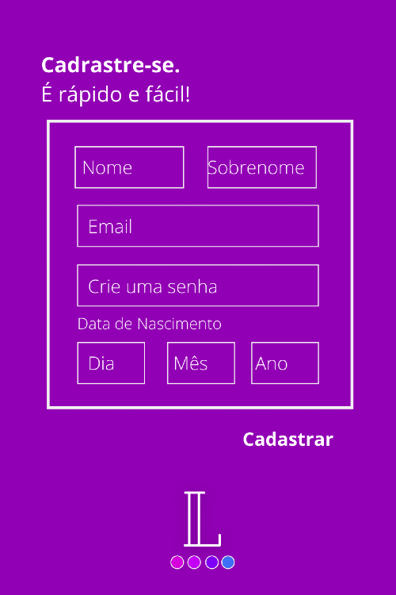
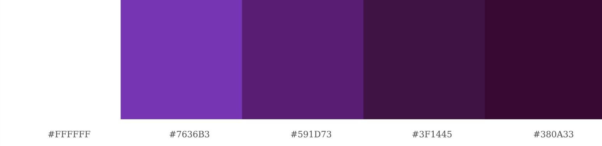

# Learning :blue_book:

Para acessar a plataforma, [clique aqui.](https://rede-social-205ff.web.app)

---
###  Introdução 

O **Learning** é uma plataforma desenvolvida para estudantes, a intenção do projeto é que seus usuários compartilhem conhecimentos e dúvidas sobre assuntos acadêmicos. 

Usamos o acrônimo CRUD na plataforma para disponibilizar as opções de: 

- Create (Criação);
- Read (Consulta);
- Update (Atualização)  ;
- Delete (Destruição) ;

Pensando na experiência do usuário disponibilizamos a opção de fazer upload de uma imagem de sua preferência no perfil, para que seja uma página personalizada e confortável.

Desenvolvemos um site responsivo, no conceito *mobile first*, no qual é possível acessar de várias dispositivos.

---
### Histórias dos Usuários.

---

---

---

---
### Prototipagem 

O Primeiro passo foi o desenvolvimento do prototipo do projeto;

---

---

---
### Conceito final
---
### Paleta de Cores

A paleta foi definida em tons de roxo;

---
### Implementações futuras

Pensando em melhorar a experiência do nosso usuário futuramente, acordamos que a página será implementada, algumas dessas implementações serão:
-  Comentários nos posts ;
-  Compartilhar e salvar publicações ;
-  Opção de fazer posts público ou privado;
-  Uploud de fotos nos posts ;
-  Adicionar e excluir amigos ;
-  Edição de perfil;
- Visualizar interação de outros usúarios no like.

---
### Desenvolvedoras

Essa aplicação foi desenvolvida por:

- [Luana Santana](https://github.com/LuanaGss)
- [Nayara Fugii](https://github.com/NayaraFugii)
- [Priscila Silveira](https://github.com/PriscilaSSilveira)

---
### Habilidades Desenvolvidas

- HTML 
- CSS
- JavaScript
- Firebase
- Responsivo 
- SPA
- Mobile First
- Git 
- Github

